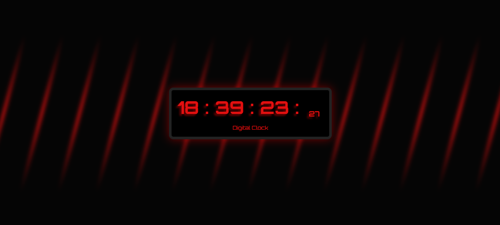

# Digital Clock Website

A simples digital clock where you can literally just see the time.

## Why did i create this?

I created a simple digital clock to discover how `Dates()` works in JavaScript (JS), for me, it was a simple, pratical and functional way to learn about it!

## About the design:

- I preferred to choose strong colors, more specifically `#e21010` (red) and a dark background to highlight the time
- For the font, I chose one that resembled a real digital clock, the closest one I found was: `Orbitron`, imported from `Google Fonts`
